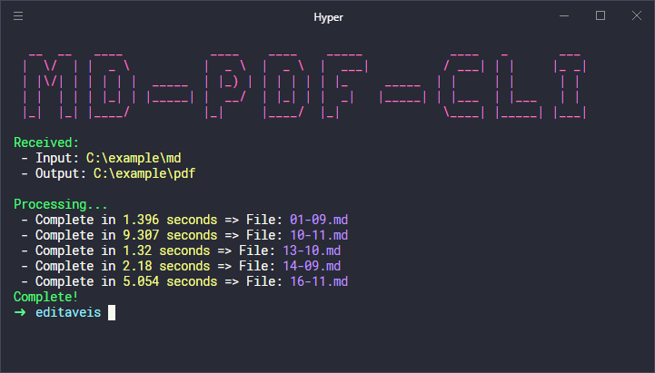

# 📕 MD-PDF-CLI

Convert MD files to PDF

<center>
  
</center>

### Global CLI

Use in the project root folder:

```
npm install -g ./
```

Now, you can use our cli by invoking the command below:

```
md-pdf-cli
```
